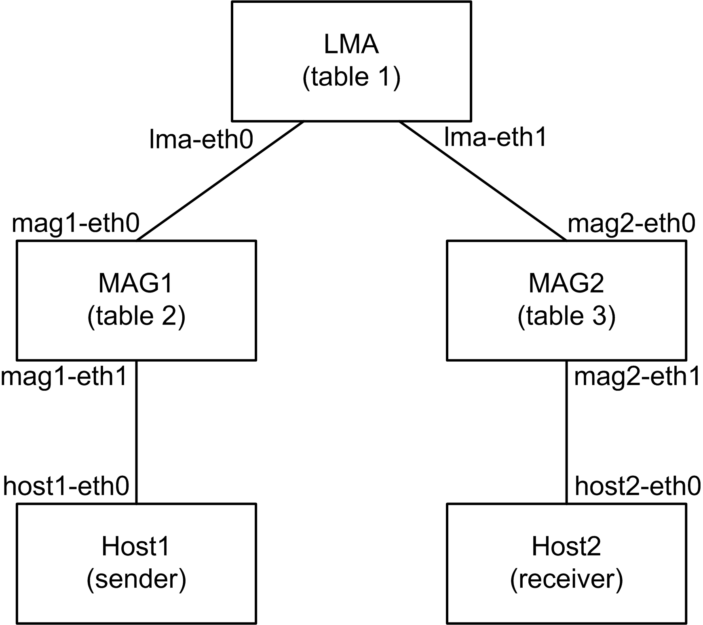
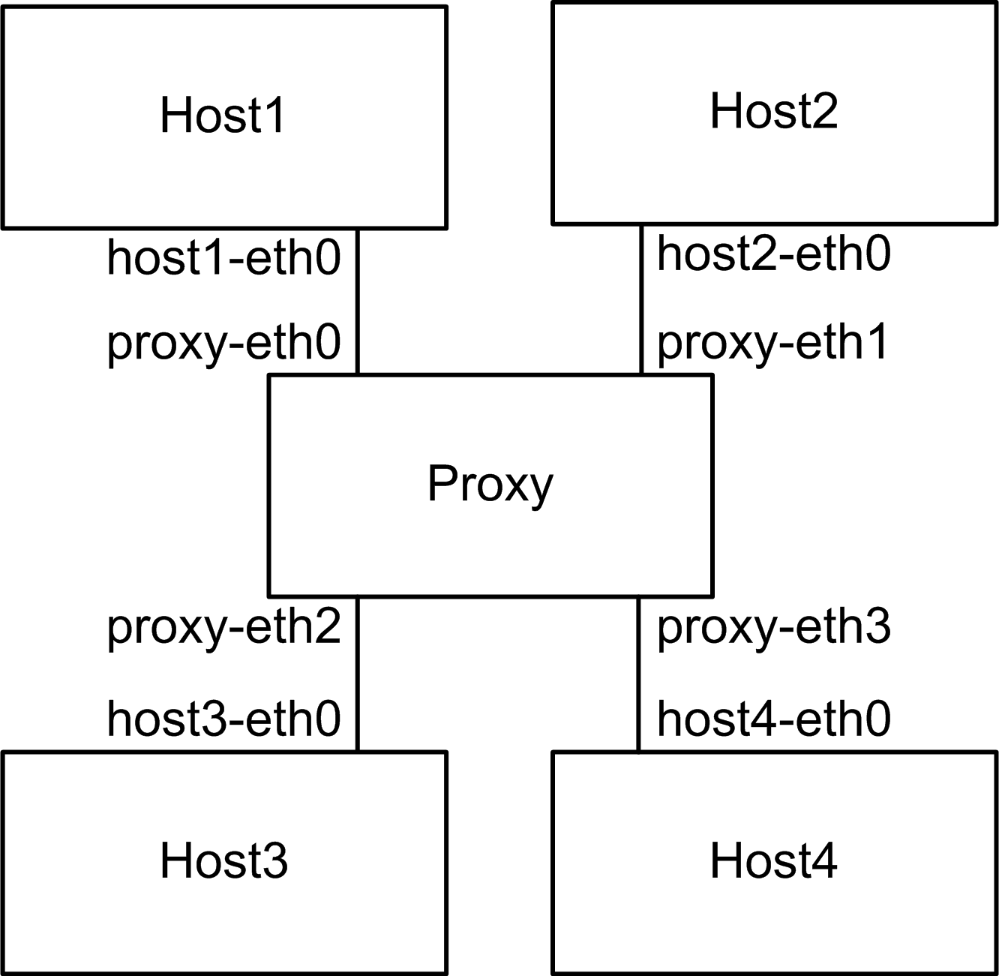
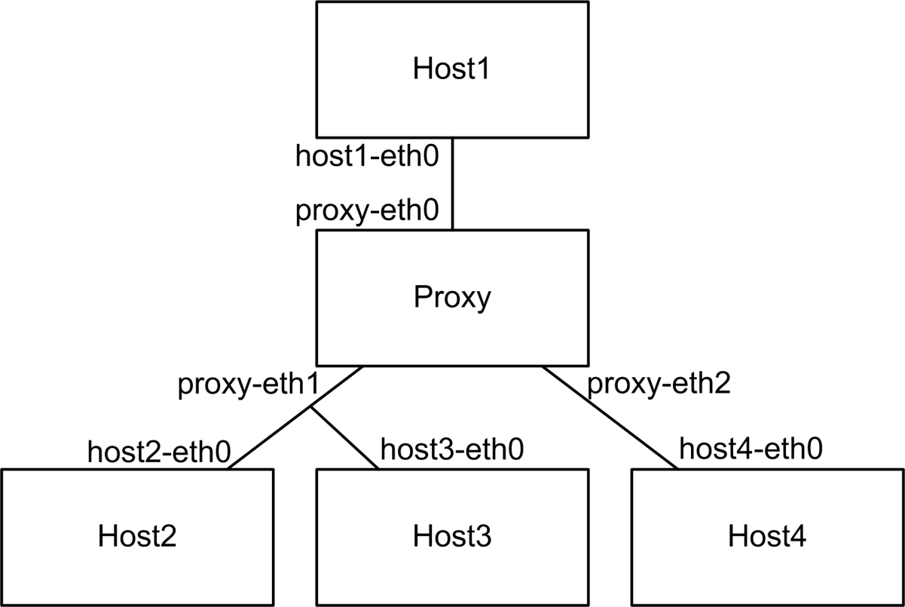

<!--vim: set textwidth=80 formatoptions+=qt wrapmargin=5 -->

Mcproxy and Mininet
===================
Here you can find examples of how to use Mcproxy within [Mininet](mininet.org).

#### Requirements
You have to install Mininet, which can usually be done with the following command:

    sudo apt-get install mininet
    
Also, you have to compile the Mcproxy and the Mcproxy Tester (see [README](../README.md#mcproxy-tester)).

#### Usage   
For Mininet you need a root shell:

    sudo su

To run the network simulation type:

    python2 network.py  

If you have problems to start mininet, try:

    killall ovs-controller
    mn -c

Example - PMIPv6
================
The topologie of the PMIPv6 example discribed by the file
[pmipv6/network.py](pmipv6/network.py) looks like this:   
                  
 

On the boxes LMA, MAG1, and MAG2 runs a single proxy instance each working on 
a different multicast routing table. The behaviour of every instance is
described in the configuration files [lma.conf](pmipv6/lma.conf),
[mag1.conf](pmipv6/mag1.conf), [mag2.conf](pmipv6/mag2.conf). Host1 sends
data of the group 239.99.99.99 to the interface _host1-eth0_ and Host2
receives hopefully these data on inteface _host2-eth0_. The exact behaviours
of the hosts are described in the file [tester.ini](pmipv6/tester.ini).
     
Example - Multi Upstream Proxy
==============================
The topologie of the Multi Upstream example discribed by the file
[multi_upstream/network.py](multi_upstream/network.py) is shown in the following
figure:   
                  
 

   
Example - Interactive Proxy
==============================

 

